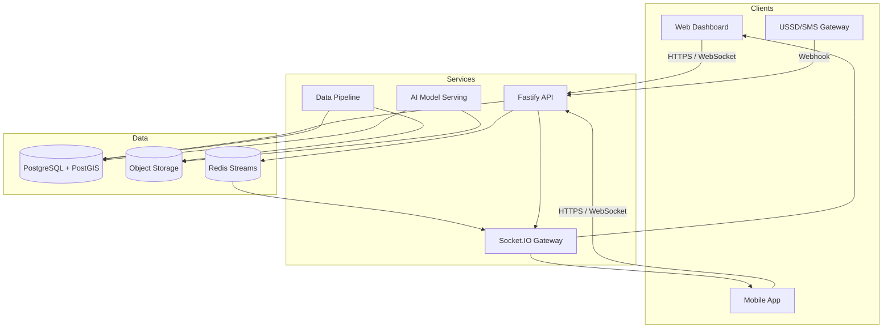

# Prompt 1 · Project Architecture Setup

## 1. Platform & Technology Overview
- **Web Frontend (`/frontend`)**: React + TypeScript, Vite build, Zustand state, React Query for data fetching, Mapbox GL for spatial views, Socket.IO client for real-time alerts, Tailwind CSS for rapid theming.
- **Mobile App (`/mobile`)**: React Native (Expo SDK 52) with React Navigation, AsyncStorage/MMKV for offline persistence, Mapbox native SDK, Expo modules for sensors, Socket.IO client, localization via `react-i18next`.
- **Backend APIs (`/backend`)**: Fastify + TypeScript with Socket.IO server, PostgreSQL/PostGIS via `pg`, JWT auth, file uploads (crop images), rate limiting, Swagger docs, background workers triggered via Redis/queues (hooked in later).
- **AI Models (`/ai-models`)**: Python pipelines (PyTorch + scikit-learn + GeoPandas) packaged with MLflow tracking, SHAP for explainability, bridging scripts exposed through npm scripts for consistency.
- **Data Pipeline (`/data-pipeline`)**: Python ETL orchestrated by Prefect / Airflow DAGs, integrates external market feeds, satellite climate feeds, Twilio/Telerivet SMS logs.
- **Shared Infrastructure**: PostgreSQL 15 + PostGIS, Redis 7 (caching + job queues), S3-compatible object storage for media, Socket.IO for live comms, Mapbox tiles.

### High-Level System Diagram


## 2. Project Structure
```
/ (repo root)
├── README.md
├── frontend/
│   ├── package.json
│   ├── src/
│   └── public/
├── mobile/
│   ├── package.json
│   └── src/
├── backend/
│   ├── package.json
│   └── src/
├── ai-models/
│   ├── package.json
│   ├── requirements.txt
│   └── src/
├── data-pipeline/
│   ├── package.json
│   ├── requirements.txt
│   └── etl/
└── docs/
    └── phase1/...
```

## 3. Core Feature Mapping
| Feature | Entry Points | Data Sources | Notes |
|---------|--------------|--------------|-------|
| User Authentication | Web, Mobile, USSD | `users`, `user_preferences` tables | Multi-role (farmer, agent, cooperative, admin) with JWT + short-lived OTP tokens.|
| Dashboard w/ Climate Alerts | Web + Mobile | `climate_alerts`, `user_alerts`, Mapbox layers | Real-time push via Socket.IO; offline cache on mobile.|
| Market Intelligence | Web, Mobile, USSD | `market_prices`, `transport_routes` | AI recommendations weigh local vs remote demand, factoring transport cost.|
| Insurance Tracking | Web, Mobile | `insurance_policies`, `insurance_payouts` | Automated triggers from climate data, manual claims from mobile.|
| Advisory System | Web (Coop/Admin), Mobile | `advisories`, `advisory_logs` | Templates stored as rich content, delivered multi-channel (SMS, WhatsApp, voice).|
| Admin Panel | Web only (role-based) | All | Manage alerts, analytics, data quality.

## 4. Module Dependency Snapshots
Each module includes a `package.json` with curated dependencies:

<details>
<summary>`frontend/package.json` highlights</summary>

- UI stack: `react`, `react-router-dom`, `zustand`, `@tanstack/react-query`
- Visualization: `recharts`, `mapbox-gl`
- Forms & validation: `react-hook-form`, `@hookform/resolvers`
- Real-time: `socket.io-client`
- Tooling: `vite`, `typescript`, `tailwindcss`, `vitest`
</details>

<details>
<summary>`mobile/package.json` highlights</summary>

- Core: `expo`, `react-native`, `react-navigation`
- Offline/persistence: `@react-native-async-storage/async-storage`, `react-native-mmkv`
- Mapping: `@react-native-mapbox-gl/maps`
- Real-time: `socket.io-client`
- Device APIs: `expo-location`, `expo-image-picker`, `expo-notifications`
</details>

<details>
<summary>`backend/package.json` highlights</summary>

- Fast server: `fastify`, `@fastify/cors`, `@fastify/rate-limit`
- Security: `fastify-jwt`, `bcryptjs`, `zod`
- Realtime: `socket.io`, `@fastify/socket.io`
- Data: `pg`, `pg-format`
- Tooling: `typescript`, `tsx`, `vitest`
</details>

<details>
<summary>`ai-models/package.json` & `requirements.txt` highlights</summary>

- npm scripts call Python tooling to keep repo consistent
- Python stack: PyTorch, GeoPandas, Rasterio, MLflow, SHAP, Albumentations
</details>

<details>
<summary>`data-pipeline/package.json` & `requirements.txt` highlights</summary>

- Prefect/Airflow for orchestration, Pandas/Geo tools for cleaning, connectors for S3, PostgreSQL, external APIs.
</details>

## 5. Environment Layout & Repos
| Environment | Branch | Purpose | Tooling |
|-------------|--------|---------|---------|
| Local dev | `dev/*` | Fast iteration with mocked services | Docker Compose, Vite dev server, Expo Go |
| Staging | `staging` | Pre-prod integration | Kubernetes namespace `shamba-staging`, feature flags |
| Production | `main` | Live farmers & cooperatives | Multi-region cluster, CDN for assets |

## 6. README & Setup Guidance
The root `README.md` now contains:
1. Overview & feature list
2. Quick-start per module (frontend, mobile, backend, AI, data pipeline)
3. Environment variable instructions
4. Testing commands
5. Contribution guidelines & next steps

## 7. Security & Compliance Considerations
- PII (farmer profiles, phone numbers) encrypted at rest using PostgreSQL column-level encryption / KMS-managed keys.
- Transport encryption enforced (HTTPS, secure WebSockets, SMPP/Twilio TLS tunnels).
- RBAC enforced at API level plus UI-level guards.
- Audit logging baked into DB triggers (see [`docs/phase5/database-schema.md`](../phase5/database-schema.md)).

## 8. Scalability Notes
- Frontend served via CDN with service worker for offline caching.
- Backend horizontally scaled using Fastify's clustering & Kubernetes HPA.
- Socket.IO via Redis adapter for multi-instance fan-out.
- Map-heavy workloads leverage Mapbox vector tiles & caching.
- Data pipelines modularized for daily ETL plus near-real-time streams.

## 9. Next Implementation Steps
1. Flesh out API contracts (Prompt 13).
2. Build component library + design system (Prompts 6–8 & 12).
3. Wire up pipelines & ML training loops.
4. Define deployment + monitoring (Prompt 15) before pilot roll-out.
