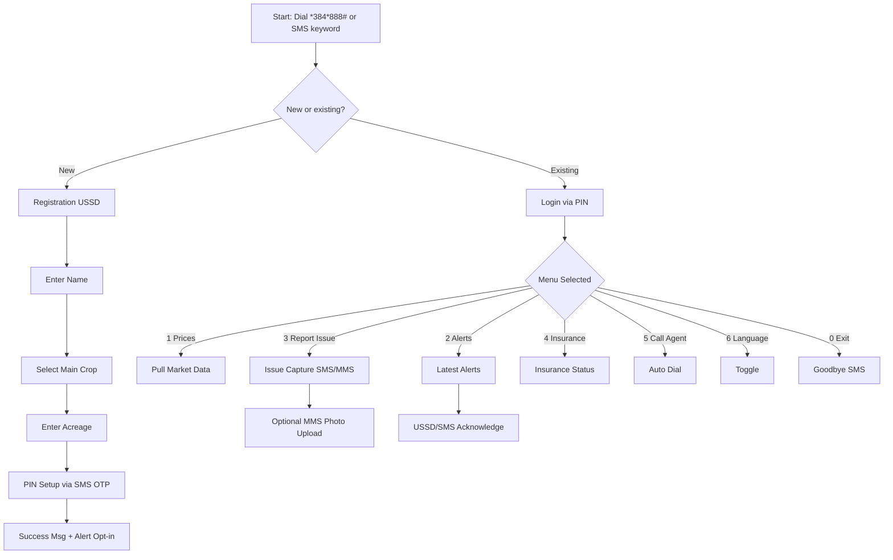
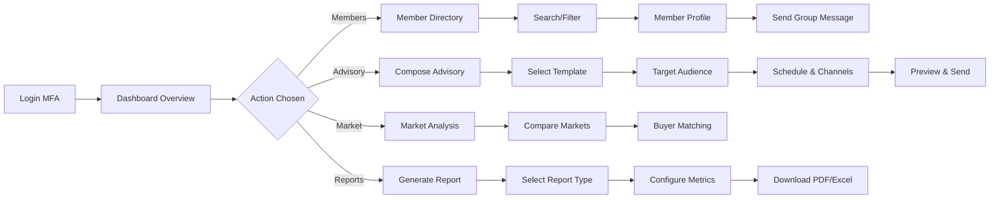
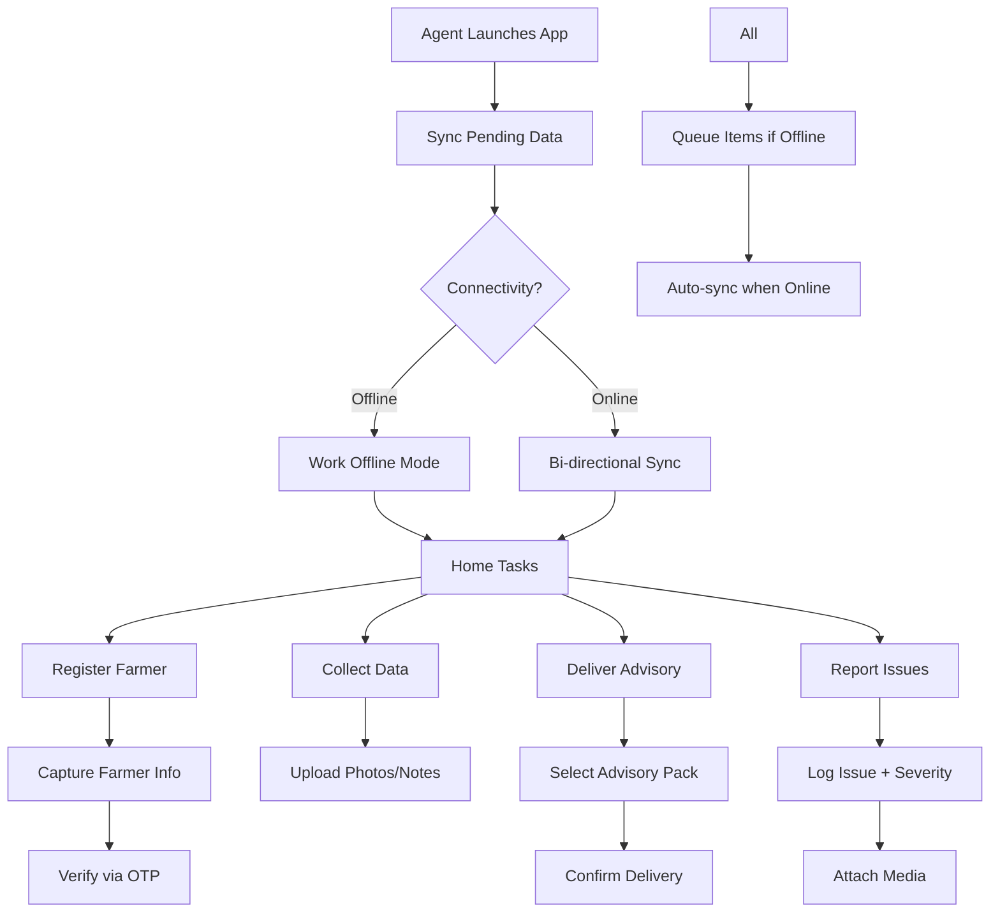

# Prompt 2 · User Flow Diagrams & Analysis

## 1. Smallholder Farmer (Feature Phone + Low Literacy)


- **Decision Points**: new vs existing, crop selection, language toggle, confirm submissions.
- **Error Handling**: retries for invalid PIN (lock after 3 attempts), fallback text instructions for MMS not supported, auto-suggest to call agent if USSD fails.
- **Success Metrics**: registration completion rate, average alert acknowledgment time, number of market checks per week, insurance claim submissions.

## 2. Cooperative Manager (Web Dashboard)


- **Decision Points**: template vs custom advisory, distribution channels (SMS/WhatsApp/email), report time range, target segment filters.
- **Error Handling**: validation for missing template fields, network retry banners, fallback CSV export if PDF generation fails, auto-save drafts every 30 seconds.
- **Success Metrics**: advisory open rate, time-to-publish, % members with complete profiles, report generation duration, number of bulk actions without errors.

## 3. Field Agent (Mobile + Offline)


- **Decision Points**: offline vs online workflows, queue vs immediate send, escalate issue vs resolve locally.
- **Error Handling**: auto retries with exponential backoff, manual "Force Sync" button, conflict resolution prompts when same farmer edited by multiple agents.
- **Success Metrics**: average time per registration, # of offline records synced without conflict, advisory delivery confirmation rate, issue resolution SLA adherence.

## 4. System Admin
```mermaid
flowchart LR
  SA[Admin Login (SSO + Hardware Key)] --> DASH[System Dashboard]
  DASH --> UM[User Management]
  DASH --> AC[Alert Configuration]
  DASH --> DM[Data Monitoring]
  DASH --> AN[Analytics]
  UM --> UM1[Role Assignment]
  UM1 --> UM2[Deactivate/Reactivate]
  AC --> AC1[Create Alert Template]
  AC1 --> AC2[Set Thresholds + Channels]
  AC2 --> AC3[Approval Workflow]
  DM --> DM1[Data Quality Rules]
  DM1 --> DM2[Resolve Anomalies]
  AN --> AN1[Usage Analytics]
  AN1 --> AN2[Export/Share Insights]
```

- **Decision Points**: severity level per alert, auto vs manual alert dispatch, retention period for data snapshots, enforcement of approvals.
- **Error Handling**: rollback on failed alert template deploy, audit log capture for role changes, detection of missing data pipelines with red status indicator.
- **Success Metrics**: number of critical alerts configured vs triggered, mean time to detect data issues, policy compliance rate, admin SLA for responding to escalations.

## Shared Error Handling Patterns
- **Session Timeouts**: extendable via "Stay signed in" prompts; unsaved form data preserved locally.
- **Invalid Inputs**: inline hints + iconography; for low-literacy flows use audio prompts or icons.
- **System Downtime**: broadcast banner + SMS fallback to all critical users with ETA updates.

## KPIs Dashboarding
| Persona | KPI | Tooling | Target |
|---------|-----|---------|--------|
| Farmer | Alert acknowledgment time | Socket.IO events + analytics | < 10 mins for urgent |
| Cooperative Manager | Advisory open rate | Delivery receipts + analytics | > 65% |
| Field Agent | Offline sync success | Sync queue logs | > 98% |
| System Admin | SLA for incident resolution | Ops dashboard | < 30 mins |
